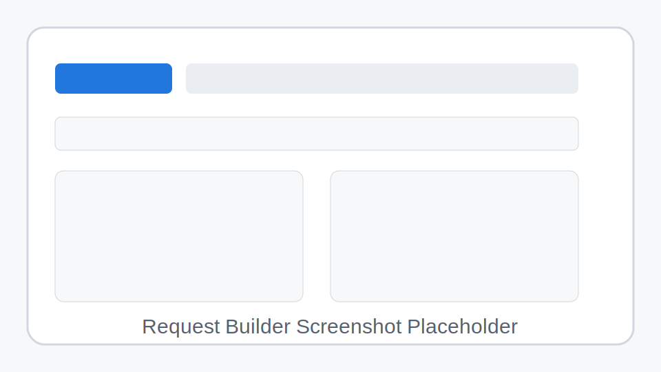
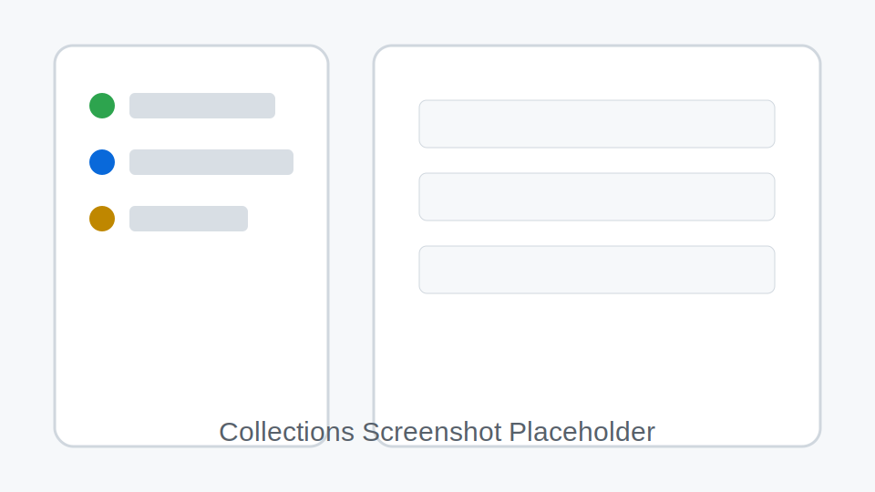
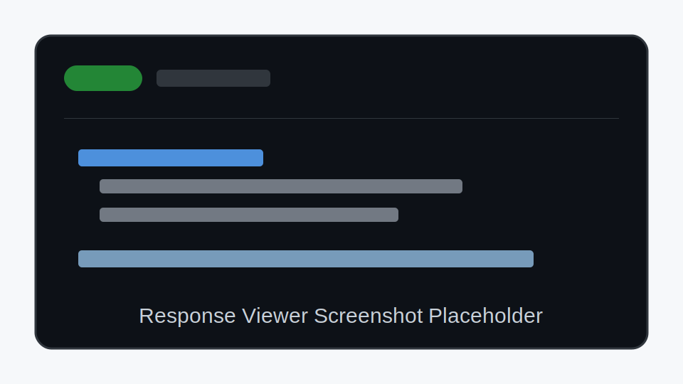

# PostBoy

PostBoy is a local-first API client and lightweight HTTP proxy built with Python and Django-compatible modules. Use it to save requests, organize collections, import cURL or Postman data, and inspect proxied responses from a browser UI.

## Screenshots

> Screenshot placeholders: replace these with current application captures before publishing.

| Request Builder | Collections | Response Viewer |
| --- | --- | --- |
|  |  |  |

## Features

- Organize API requests into nested collections.
- Build requests with custom methods, headers, auth, and body content.
- Import Postman collections and cURL commands.
- Send requests directly from the browser in client mode or through the built-in Django/PostBoy server proxy.
- View status, timing, headers, and formatted response bodies.
- Store data locally in SQLite.

## Execution modes and CORS

PostBoy can execute a request in two ways from the request URL bar:

- **Client side** sends the request with the browser `fetch` API. This mode can only call APIs that allow browser requests with compatible CORS response headers, browser-allowed request headers, the selected browser credentials mode (`omit`, `same-origin`, or `include`), and other browser security policies.
- **Server proxy** sends the request from the Django/PostBoy backend. Because the backend makes the outbound request instead of the browser, this mode bypasses browser CORS checks while still depending on backend connectivity, proxy timeout settings, and upstream API availability.


For browser-to-PostBoy traffic, CORS can be controlled with environment variables (useful in Docker):

```yaml
# docker-compose*.yml
environment:
  - CORS_ALLOWED_ORIGINS=http://localhost:8080,http://127.0.0.1:8080
  - CORS_ALLOWED_ORIGIN_REGEXES=^https://.*\\.example\\.com$
  - CORS_ALLOW_ALL_ORIGINS=false
  - CORS_ALLOW_CREDENTIALS=true
  - CSRF_TRUSTED_ORIGINS=http://localhost:8080,http://127.0.0.1:8080
```

`CORS_ALLOW_ALL_ORIGINS` defaults to `true` in `DEBUG` and `false` otherwise. For production, set explicit origins and keep `CORS_ALLOW_ALL_ORIGINS=false`.

## Quick Start

```bash
python -m venv venv
source venv/bin/activate
pip install -r requirements.txt
python app.py
```

Open `http://localhost:3001` in your browser.

On Windows, activate the virtual environment with:

```powershell
venv\Scripts\activate
```


## Django management workflows

Use `manage.py` for common project maintenance commands:

```bash
python manage.py check
python manage.py migrate
python manage.py runserver
```

## Docker

PostBoy includes Docker assets for both local SQLite development and production-like PostgreSQL runs. Both modes build the same image, install `requirements.txt`, and serve the WSGI app with Gunicorn.

### Dev SQLite mode

Use the development compose file when you want a quick local container with SQLite persistence:

```bash
docker compose -f docker-compose.dev.yml up --build
```

Open `http://localhost:8080` in your browser. SQLite data is stored in the named `postboy-sqlite-data` Docker volume at `/data/postboy-data.db` inside the container. The Django app stays internal on Docker network `app:3001`, and Nginx is the public entrypoint.

The dev compose file publishes Nginx on `8080:80` explicitly to avoid conflicts on host port 80. Browser calls should use same-origin `/client-proxy` (never `http://localhost:3001/client-proxy`).

### Production-like PostgreSQL mode

Use the default compose file to run PostBoy with a PostgreSQL service:

```bash
POSTBOY_SECRET_KEY=replace-with-a-long-random-value docker compose up --build
```

Open `http://localhost` in your browser. PostgreSQL data is stored in the named `postboy-postgres-data` Docker volume. The Django app remains internal to Docker and is only reached through Nginx.

To stop containers without deleting persisted data:

```bash
docker compose down
```

To remove the PostgreSQL volume as well:

```bash
docker compose down -v
```


### Docker dev proxy notes

- Django/Gunicorn runs only on the Docker network as `app:3001` (`expose`, not host `ports`).
- Nginx is the local public entrypoint at `http://localhost:8080`.
- Browser proxy calls must target relative `POST /client-proxy`, which Nginx rewrites to Django `POST /api/proxy`.
- On SELinux hosts, the Nginx config bind mount uses `:ro,Z` so `/etc/nginx/conf.d/default.conf` is readable inside the container.

### Reverse-proxy and CORS model

CORS is enforced by the browser and cannot be bypassed safely with client-side JavaScript. In Docker deployment, PostBoy uses a same-origin proxy route so the browser always calls `POST /client-proxy` on the Nginx origin (`http://localhost`). Nginx forwards that request to Django `POST /api/proxy`, and Django performs the external API call server-side.

### Docker environment variables and volumes

| Variable | Docker usage |
| --- | --- |
| `POSTBOY_CONFIG` | Set to `development` in `docker-compose.dev.yml` and `production` in `docker-compose.yml`. |
| `POSTBOY_DATABASE_URL` | Required for PostgreSQL mode; the default compose file points at the `db` service. Leave unset for SQLite mode. |
| `POSTBOY_DB_PATH` | SQLite database path for dev mode; `docker-compose.dev.yml` sets it to `/data/postboy-data.db`. |
| `POSTBOY_SECRET_KEY` | Required for signed sessions. Override the local defaults with a strong random value before sharing or deploying. |
| `PORT` | App listen port in non-Docker runs; Docker compose keeps internal app port fixed at `3001` for the Nginx upstream. |

| Volume | Used by | Purpose |
| --- | --- | --- |
| `postboy-sqlite-data` | `docker-compose.dev.yml` | Persists the SQLite database under `/data`. |
| `postboy-postgres-data` | `docker-compose.yml` | Persists PostgreSQL data under `/var/lib/postgresql/data`. |

## Testing

Install Python dependencies explicitly before running tests:

```bash
pip install -r requirements.txt
pytest
```

## Configuration

PostBoy works out of the box for local development. Useful environment variables:

| Variable | Default | Description |
| --- | --- | --- |
| `PORT` | `3001` | Server port. |
| `POSTBOY_CONFIG` | `development` | Built-in config name or import path. |
| `POSTBOY_DB_PATH` | `postboy-data.db` | SQLite database path. |
| `POSTBOY_PROXY_TIMEOUT` | `30` | Proxy timeout in seconds. |
| `CORS_ALLOWED_ORIGINS` | empty | Comma-separated exact origins allowed to call PostBoy from browsers. |
| `CORS_ALLOWED_ORIGIN_REGEXES` | empty | Comma-separated regex patterns for allowed origins. |
| `CORS_ALLOW_ALL_ORIGINS` | `true` in debug, else `false` | Allow any origin when enabled. Prefer disabling in production. |
| `CORS_ALLOW_CREDENTIALS` | `true` | Include `Access-Control-Allow-Credentials: true` for allowed origins. |
| `CSRF_TRUSTED_ORIGINS` | empty | Comma-separated trusted origins for Django CSRF origin checks (must include scheme and port). |
| `POSTBOY_MAX_CONTENT_LENGTH` | `10485760` | Maximum request/import payload size. |

Example:

```bash
PORT=8080 POSTBOY_CONFIG=production python app.py
```

## Project Layout

```text
app.py                  # Server entrypoint
requirements.txt        # Python dependencies
public/                 # Browser UI assets
pypostboy/              # Application package
pypostboy/routes/       # HTTP route handlers
pypostboy/services/     # Import, cURL parsing, and proxy logic
pypostboy/repositories/ # SQLite persistence layer
tests/                  # Backend test suite
```

## API Overview

| Area | Endpoints |
| --- | --- |
| Collections | `GET/POST /api/collections`, `GET/PUT/DELETE /api/collections/:id`, `POST /api/collections/:id/duplicate` |
| Requests | `GET/POST/PUT/DELETE /api/requests`, `GET /api/requests/:id`, `POST /api/requests/:id/duplicate`, `PUT /api/requests/:id/move` |
| Import | `POST /api/import` |
| Client proxy ingress (browser → Nginx) | `POST /client-proxy` |
| Server proxy handler (Nginx → Django) | `POST /api/proxy` |

## Security Notes

PostBoy is intended for local development. The proxy forwards requests as provided, and saved secrets remain in the local SQLite database. Do not expose an instance to public networks without adding appropriate authentication and network controls.

## License

Add license information before distribution.

## Electron Desktop Mode (optional)

PyPostBoy can also run as a secure Electron desktop shell while keeping the Django backend and web UI unchanged.

### Why this exists

Browsers enforce CORS and other browser-only policies for direct client requests. In **Desktop native** mode, requests execute in Electron's main process (Node networking), so browser CORS limitations do not apply to that mode.

- **Client side**: browser fetch, CORS applies
- **Server proxy**: backend proxy route, CORS bypassed via backend
- **Desktop native**: Electron main-process HTTP execution, CORS bypassed in desktop runtime

### Desktop architecture

- `electron/main/index.js`: creates window and handles narrow IPC endpoint `desktop:request:execute`
- `electron/preload/index.js`: secure bridge via `contextBridge` only
- `electron/request-executor/validation.js`: IPC payload validation and normalization
- `electron/request-executor/index.js`: HTTP execution logic (Node/undici)
- `public/js/desktop/bridge.js`: frontend adapter for desktop-native execution mode

Security defaults used:

- `contextIsolation: true`
- `nodeIntegration: false`
- `sandbox: true`
- no raw `ipcRenderer` exposed to renderer
- explicit payload validation before any outbound request

### Development setup

Install JS dependencies once:

```bash
npm install
```

Run Django only:

```bash
npm run dev:django
```

Run Electron shell (expects Django on `http://localhost:3001`):

```bash
npm run dev:electron
```

Run both together:

```bash
npm run dev:desktop
```

### Packaging foundation

Electron Forge is configured.

```bash
npm run package
npm run make
```

These commands provide baseline desktop packaging outputs and can be extended per target OS/signing requirements.

## React dashboard frontend (Vite + Tailwind)

A new React + TypeScript dashboard entrypoint is available at `/dashboard/` while the legacy app remains at `/`.

### Why this hosting strategy

The dashboard build outputs directly into `public/dashboard/`, which is generated build output and intentionally not committed. The generated directory is required for `/dashboard/` in any deployment where the dashboard link is enabled. Build workflows must run `npm run frontend:build` before serving, packaging, or deploying the app so `public/dashboard/index.html` and its assets exist. The existing Django static/SPA handler then serves the generated dashboard without a new backend route.

### Install frontend dependencies

```bash
npm run frontend:install
```

### Run dashboard dev server

```bash
npm run frontend:dev
```

Default Vite dev URL: `http://localhost:5173/dashboard/`.

### Build dashboard for Django static serving

```bash
npm run frontend:build
npm run frontend:check
```

Build output is written to:

- `public/dashboard/index.html`
- `public/dashboard/assets/*`

Because Django already serves files under `public/`, deployment does not need a new static mount. Docker and Electron packaging workflows build the dashboard first, and CI runs `npm run frontend:check` to fail if the `/dashboard/` link is enabled without a generated `public/dashboard/index.html`.
